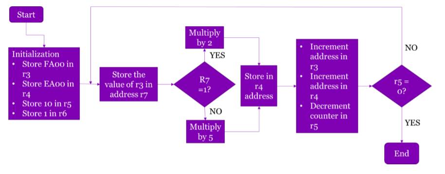
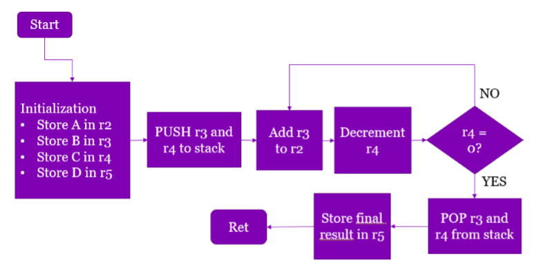

# NIOS_2_Examples
Nios II Processor (FPGAs) sample code. Part of teaching material for Microprocessors and Digital Logic that was made to aid students understanding of Assembly. This repository consists of 3 sample codes.

1) Creating a Sequence

2) Pushing and Popping

3) Interrupts and use of LED's + Pushbuttons

Start with LED’s 4 to 6 activated and all other LED’s deactivated. Every time pushbutton 0 is pressed/released, the LED lights slide left while when pushbutton 1 is pressed/released the LED lights slide to the right. The amount of bits to slide is defined by the binary number represented by the switches.

